# Vendas de Veículos -  Daniel Boaventura 010624049

Projeto desenvolvido em **Laravel** para gerenciamento de venda de veículos. Possui área pública (site) e área administrativa (painel admin) para gerenciar marcas, modelos, cores e veículos.
 

---

##  Como rodar o projeto

Clone do repositório:
bash 
git clone https://github.com/danielboaventura/vendas-veiculos.git

Entre na pasta do projeto:
cd vendas-veiculos

Instale as dependências do Composer:
composer install

Copie o arquivo .env.example para .env e configure suas credenciais de banco

Gere a chave do Laravel:
php artisan key:generate

Rode as migrations e o seeder para criar o banco e popular dados iniciais:
php artisan migrate --seed

Rode o servidor local do Laravel:
php artisan serve

O projeto estará disponível em: http://127.0.0.1:8000.

## Usuário Administrador

Para acessar a área administrativa, use:

E-mail: admin@admin.com

Senha: 12345678

---

## Área Administrativa

Dashboard

Gerenciamento de Marcas

Gerenciamento de Modelos

Gerenciamento de Cores

Gerenciamento de Veículos

## Tecnologias utilizadas

PHP 8.2

Laravel 12

MySQL

Bootstrap 5

## 📸 Prints das telas

---

# 🟦 Área Pública

### 🏠 Home
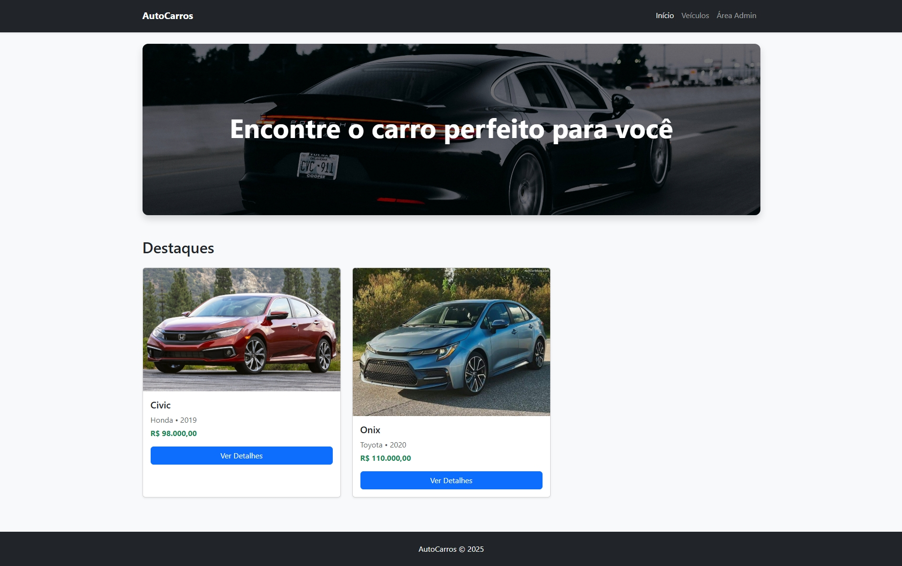

### 🚗 Lista de Veículos
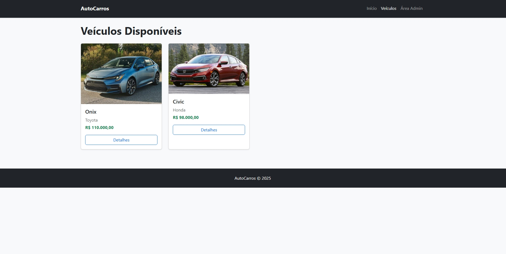

### 🔍 Detalhes do Veículo
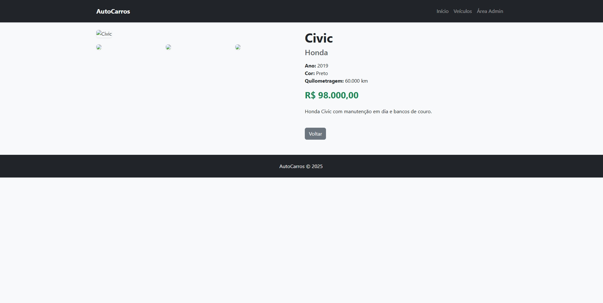

---

# 🟧 Área Administrativa

### 🎨 Gerenciar Cores
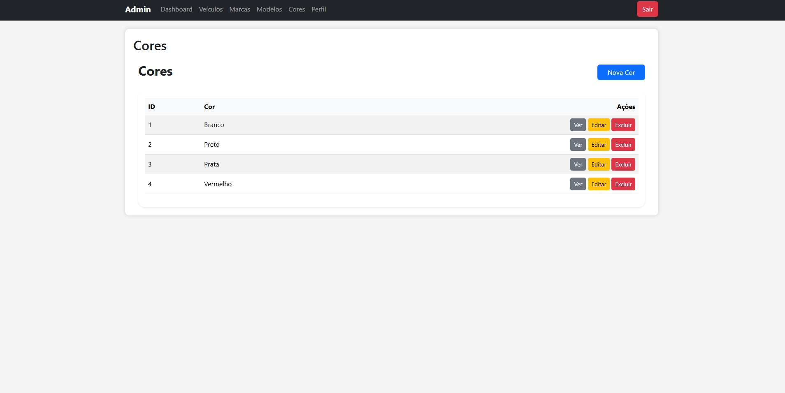

### 🏷️ Gerenciar Marcas
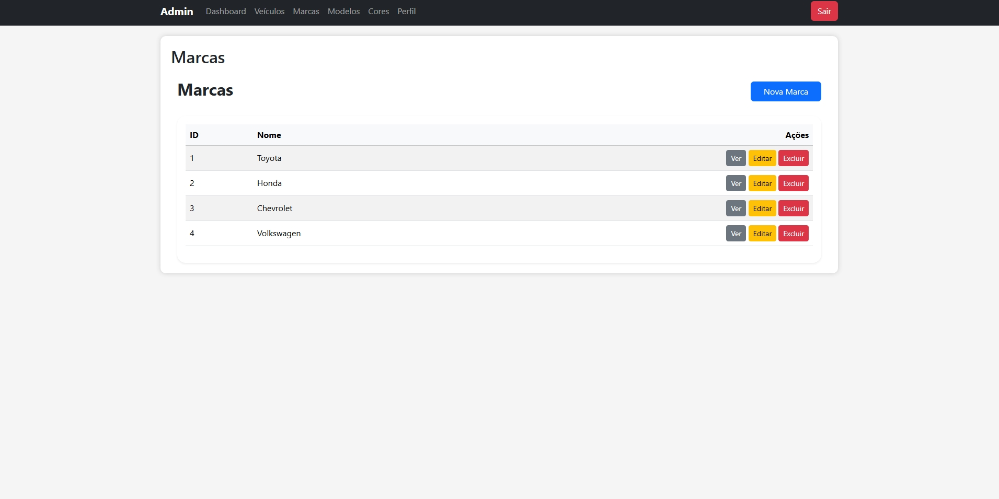

### 🚘 Gerenciar Modelos
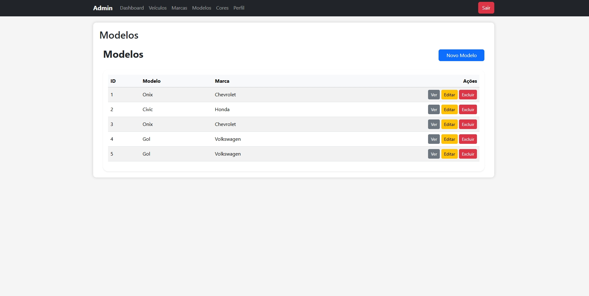

### 📦 Gerenciar Veículos
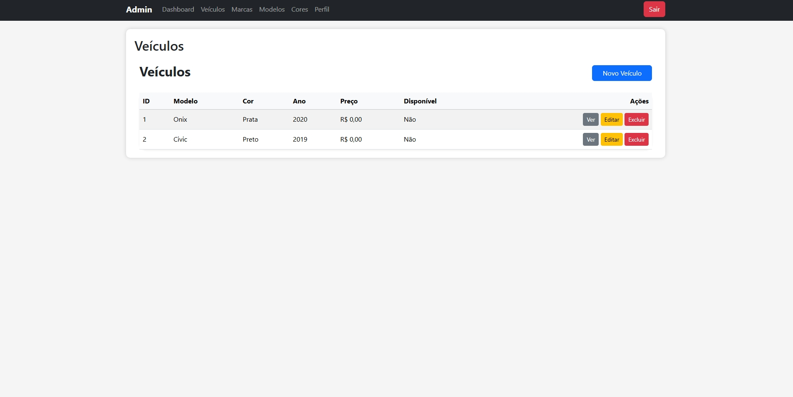

### 🖥️ Área do Admin

### 🗑️ Veículos Excluídos
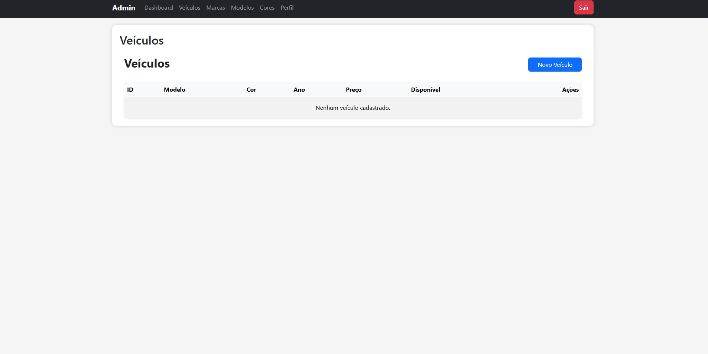

### ✏️ Editar Veículo
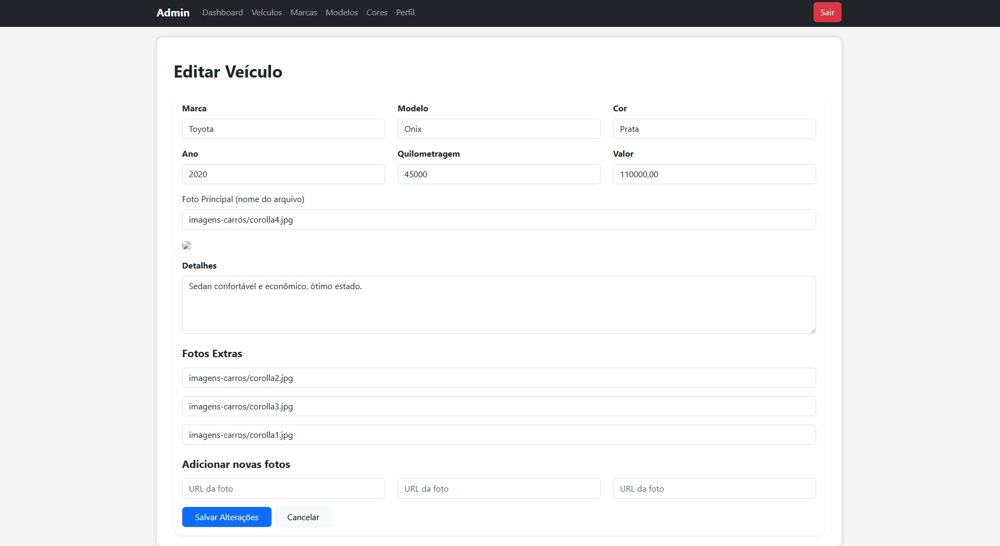

### ✏️ Editar Modelo
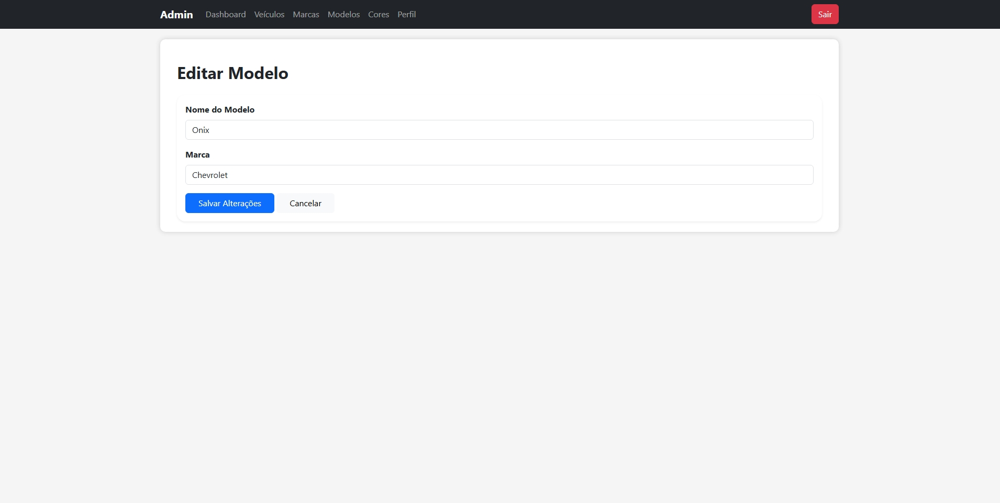

### ✏️ Editar Marca
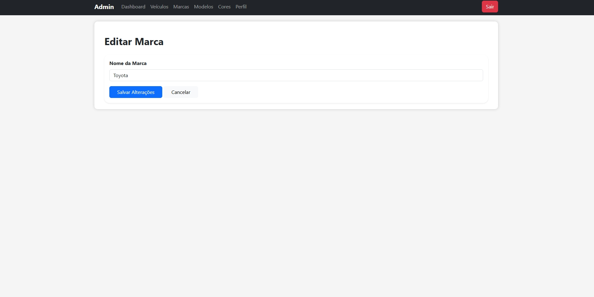

### ➕ Cadastro de Veículos
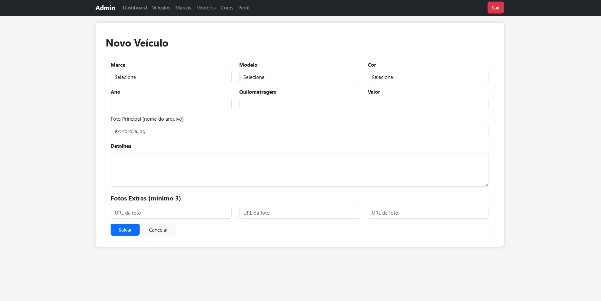

Feito com ❤️ por Daniel Boaventura  